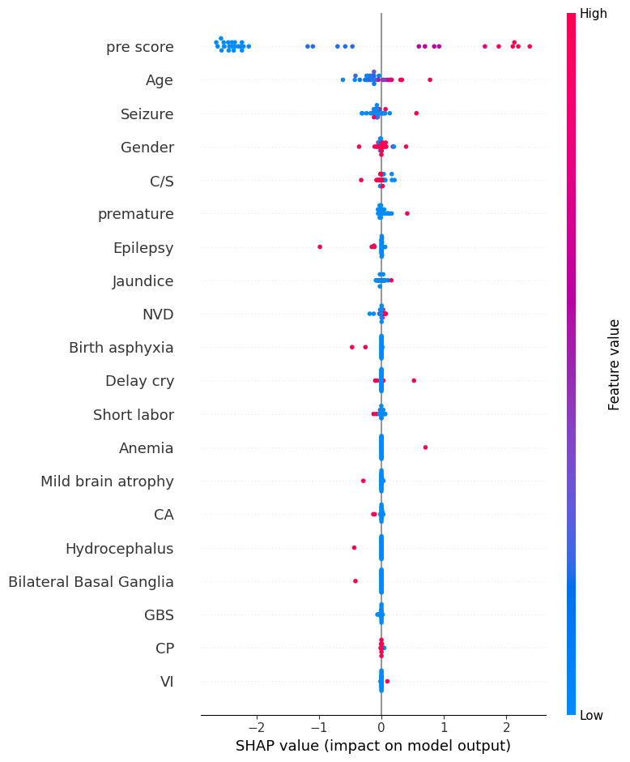

# Cerebral Palsy Therapy Outcome Prediction (Explainable ML)

## Overview
This project focuses on predicting post-therapy oral activity outcomes for children diagnosed with Cerebral Palsy (CP) using machine learning. The goal is to support clinicians and caregivers by providing **early, data-driven insights** into therapy effectiveness before treatment begins.

Unlike many prior approaches that rely on imaging data (MRI/CT) or purely statistical analysis, this work uses **pre-therapy clinical and demographic data** and applies **ensemble learning with explainability** to build a practical clinical decision-support tool.

---

## Problem Statement
Cerebral Palsy presents with diverse motor and functional impairments, and predicting therapy outcomes is challenging due to:
- High patient variability
- Limited clinical data
- Imbalanced outcome classes
- Need for interpretability in healthcare settings

Accurate early prediction of therapy outcomes can help:
- Improve therapy planning
- Set realistic expectations for caregivers
- Enable timely and effective interventions

---

## Dataset Description
The dataset consists of **clinical records from 120 pediatric patients (ages 1–10)** collected from a rehabilitation hospital.

### Input Features
- Demographic information (age, gender)
- Birth history and perinatal conditions
- Medical causes (encoded as binary indicators, e.g., seizure, short labor)
- Diagnosis categories
- Pre-therapy oral activity scores

### Target Variable
- Post-therapy oral activity scores (scale: **0–5**)

Activities include:
- Eating, grooming, bathing, dressing
- Bladder and bowel management
- Bed mobility and transfers
- Crawling, stair climbing, indoor and outdoor locomotion
- Reaching, grasping, bilateral use
- Functional comprehension, expression, peer play

> ⚠️ **Note:** Due to privacy and ethical constraints involving pediatric clinical data, the raw dataset is not publicly shared.

---

## Methodology

### 1. Data Preprocessing
- Missing values handled using **majority voting**
- Multi-cause medical conditions encoded using binary feature expansion
- **Stratified 70–30 train-test split** to preserve class distribution

### 2. Handling Class Imbalance
The dataset is highly imbalanced across outcome classes (0–5).  
To address this, **SMOTE (Synthetic Minority Over-Sampling Technique)** is applied **only on training data**, ensuring realistic synthetic samples while preventing data leakage.

---

## Model Architecture

### Stacking Ensemble Classifier
The final model uses a **stacked ensemble approach**, combining multiple learners to improve generalization.

#### Base Learners
- **XGBoost** (Gradient-boosted decision trees)
- **Deep Neural Network (DNN)** with ReLU activations

#### Meta-Learner
- **Logistic Regression**, trained on base-model predictions

This architecture leverages both tree-based and deep learning representations while maintaining robustness on small clinical datasets.

---

## Hyperparameter Optimization
- **Random Search** used for hyperparameter tuning
- 20 configurations evaluated per model
- Parameters tuned include:
  - XGBoost estimators, learning rate, tree depth
  - DNN epochs and batch size
  - Meta-learner regularization strength

---

## Evaluation Metrics
Models are evaluated using:
- Accuracy
- Precision
- Recall
- F1-Score
- ROC-AUC

These metrics provide a balanced assessment, particularly important for **imbalanced healthcare data**.

---

## Results Summary
The stacking ensemble consistently outperformed traditional models such as **AdaBoost** and **Random Forest** across most activities.

- Best observed accuracy: **83%** (bowel management)
- Improved discrimination in multiple functional activities
- More stable performance across imbalanced classes

Performance variations across activities highlight real-world clinical challenges and data limitations.

---

## Explainability (SHAP)
To ensure trust and clinical usability, **SHAP (SHapley Additive exPlanations)** is used for post-hoc interpretability.

The summary plot below highlights the most influential features contributing
to post-therapy outcome predictions.

Key observations:
- Pre-therapy oral activity score is the strongest predictor
- Age significantly influences predicted outcomes
- Certain medical conditions (e.g., seizures, birth complications)
  have measurable impact on therapy effectiveness

---

## Limitations
- Small dataset size (120 patients)
- Performance variability across different activities
- Class imbalance remains challenging despite SMOTE

These limitations reflect common constraints in real-world clinical ML applications.

---

## Future Work
- Expand dataset with more diverse patients and therapy types
- Incorporate clinician feedback to validate model reliability
- Explore advanced deep learning and multi-task learning approaches
- Deploy as a lightweight clinical decision-support tool

---

## Ethical Considerations
This project prioritizes:
- Patient privacy
- Ethical data handling
- Transparent and interpretable modeling

All shared code is designed to be **reproducible without exposing sensitive data**.

---

## Tech Stack
- Python 3.10
- scikit-learn
- XGBoost
- imbalanced-learn (SMOTE)
- SHAP
- NumPy, Pandas, Matplotlib, Seaborn

---

## Author
This project was developed as part of an applied machine learning study focused on **explainable healthcare AI** and **clinical outcome prediction**.
